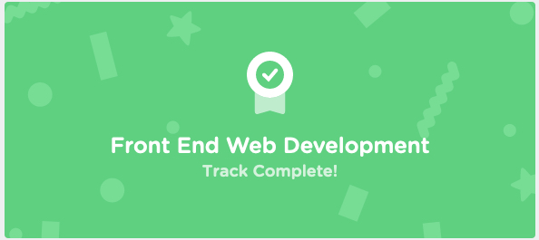

# Projects
* [Silas Web](https://peterplays.github.io/silas-website)
* [Silas Math](https://peterplays.github.io/silas-math)
* [Spanish Flashcards](https://peterplays.github.io/Spanish-Flashcards)
* [Workout Generator](https://peterplays.github.io/Workout-Generator)
* [Mondrian CSS Grid](https://peterplays.github.io/Mondrian-CSS-Grid)
* [Guitarist Picks and Strings DB](https://peterplays.github.io/Guitarist-Picks-Strings)
* [Hair Stylist Portfolio Site](https://peterplays.github.io/Hairstylist)
* [Coding Cheat Sheets](https://peterplays.github.io/cheatsheets)

## [Gists/Cheatsheets](https://gist.github.com/peterplays)
* [Console Foundations](https://gist.github.com/peterplays/ec41c0c2a3cbead88a1dcfaf1c48e30d)
* [MongoDB](https://gist.github.com/bradtraversy/f407d642bdc3b31681bc7e56d95485b6)
* 

## Education, Training, Certifications
* [Google IT Support Specialist Certificate](https://www.coursera.org/professional-certificates/google-it-support)
* 
* [Treehouse](https://www.teamtreehouse.com) Front End Web Development Track Certificate
* 
* [SoloLearn](https://www.sololearn.com) [HTML](https://peterplays.github.io/media/HTML-Certificate-SoloLearn.pdf), [CSS](https://peterplays.github.io/media/CSS-Certification-SoloLearn.pdf), and JavaScript fundamentals Certificates
* 
* Apple Swift Playgrounds

## Welcome to GitHub Pages

You can use the [editor on GitHub](https://github.com/peterplays/peterplays.github.io/edit/master/README.md) to maintain and preview the content for your website in Markdown files. Whenever you commit to this repository, GitHub Pages will run [Jekyll](https://jekyllrb.com/) to rebuild the pages in your site, from the content in your Markdown files.

### Markdown

Markdown is a lightweight and easy-to-use syntax for styling your writing. For more details see [GitHub Flavored Markdown](https://guides.github.com/features/mastering-markdown/).

```markdown
**Bold** and _Italic_ and `Code` text

[Link](url) and 

~~strikethrough~~
```

### Jekyll Themes

Your Pages site will use the layout and styles from the Jekyll theme you have selected in your [repository settings](https://github.com/peterplays/peterplays.github.io/settings). The name of this theme is saved in the Jekyll `_config.yml` configuration file.

### Documentation

Having trouble with Pages? Check out our [documentation](https://docs.github.com/categories/github-pages-basics/)


### Test Section

This is a test section in my local clone.

### Another Test Section

Added another test section to practice pushing to remote via command line.
